# Interactive App Demo — ECP ParkBuddy × ParkBunny

## Goal

Build a **configurable, browser-based interactive demo** inside the ParkBunny Next.js app that simulates a complete parking user journey: **Find → Pay → Unlock Deals → Redeem**. The first instance targets **ECP ParkBuddy** (Mayfair, W1K 1AB) but the architecture must support spinning up a new demo for any operator by swapping a single JSON config.

The demo sells the vision: **"Smarter parking that pays drivers back."**

---

## User Review Required

> [!IMPORTANT]
> This is a **new feature module**, not a modification of existing reports. It introduces a `/demo/[slug]` route with its own component tree, a Google Places-backed deals system, and a full payment simulation. No existing routes or data are modified.

> [!WARNING]
> Google Places API will be called at build-time/first-load to populate nearby deals for the Mayfair location. This will consume API quota. Consider pre-caching the data after first successful fetch to avoid repeated calls during demos.

---

## Design Decisions (Confirmed)

| Decision | Answer |
|----------|--------|
| Architecture | Inside ParkBunny Next.js app (`/demo/[slug]`) |
| Config storage | Static JSON per operator in `src/lib/demo-configs/` |
| Map | Real Leaflet map centred on car park location |
| Nearby deals | Real Google Places data (closest Costa, Pret, etc.) |
| Payment sim | Full mock — reg plate input, duration selector, animated processing |
| Navigation | Hybrid — linear first-time journey, then free exploration |
| Password | No login required (open demo) |
| Branding | Full white-label — operator name, logos, colours, all configurable |
| Savings counter | Session-only (resets on refresh) |
| Partner View | Togglable from within the demo (user switches) |
| National deals | Real brands (Costa, Vue, Tesco, Pret, Nando's, Greggs) with fictional offer terms |
| Priority | Full 7-screen journey |

---

## ECP ParkBuddy Brand Extraction

| Element | Value |
|---------|-------|
| Primary Blue | `#36C5FD` (CTA buttons, search bar) |
| Corporate Blue | `#003399` (Euro Car Parks logo block) |
| Accent Yellow | `#FFCC00` (logo text) |
| Background | `#FFFFFF` |
| Font | `Arial, sans-serif` |
| ParkBuddy Logo | `https://www.ecpparkbuddy.com/_templates/ECP/images/logo2.png` (white wordmark + smiley infinity icon) |
| Corporate Logo | `https://www.ecpparkbuddy.com/_templates/ECP/images/logo.png` (dark blue block, yellow text) |


---

## Proposed Changes

### Config System

#### [NEW] `src/lib/demo-configs/types.ts`

TypeScript types for the demo configuration schema:

```ts
type DemoConfig = {
  slug: string                    // URL slug: "ecp-parkbuddy"
  operator: {
    name: string                  // "ECP ParkBuddy"
    tagline: string               // "Smarter parking that pays drivers back"
    logo: string                  // "/demo/ecp-parkbuddy/logo.png"
    logoAlt: string               // "/demo/ecp-parkbuddy/logo-alt.png"
    colors: {
      primary: string             // "#36C5FD"
      secondary: string           // "#003399"
      accent: string              // "#FFCC00"
      background: string          // "#FFFFFF"
      text: string                // "#1a1a2e"
    }
    font: string                  // "Arial, sans-serif"
  }
  location: {
    name: string                  // "Mayfair"
    address: string               // "Achilles Way, London"
    postcode: string              // "W1K 1AB"
    phone: string                 // "0330 022 3866"
    locationCode: string          // "684543"
    city: string                  // "London"
    totalSpaces: number           // 304
    hourlyRate: number            // 4.50
    lat?: number                  // Pre-geocoded (optional)
    lng?: number
  }
  deals: DemoDeal[]               // Pre-configured deal cards
  partnerView: {
    baselineRevenue: number       // Annual baseline
    projectedUplift: number       // % uplift
    avgDwellIncrease: number      // Minutes
    partnerEngagement: number     // %
    driverRetention: number       // %
  }
}

type DemoDeal = {
  brand: string                   // "Costa Coffee"
  logo: string                    // Brand logo path
  offer: string                   // "Free drink with £3 spend"
  category: string                // "food_and_drink"
  savingsValue: string            // "£3.50"
  expiryMinutes: number           // 120
  placeQuery?: string             // Google Places search term for distance
}
```

#### [NEW] `src/lib/demo-configs/ecp-parkbuddy.json`

The ECP ParkBuddy demo seed data using the schema above, pre-populated with:
- Mayfair location details (W1K 1AB, 304 spaces, £4.50/hr)
- 6 national brand deals (Costa, Vue, Tesco, Pret, Nando's, Greggs) with fictional offer terms
- Partner View metrics appropriate for a 304-space Mayfair site
- ECP brand colours and logo references

#### [NEW] `src/lib/demo-configs/index.ts`

Loader that imports all config JSONs and exports a `getDemoConfig(slug: string)` lookup function.

---

### Data Layer

#### [NEW] `src/lib/demo-places.ts`

Lightweight Google Places fetcher specifically for demo deals:
- Takes a `DemoConfig` and fetches real distances from car park to nearest branch of each deal brand
- Uses Google Places `searchNearby` with the car park's lat/lng and each deal's `placeQuery` (e.g., "Costa Coffee")
- Returns enriched deal objects with real walking distance + address
- Implements a caching layer (file-based or in-memory) to avoid repeated API calls during presentations
- Falls back to hardcoded plausible distances if the API fails

---

### App Route

#### [NEW] `src/app/demo/[slug]/page.tsx`

Server component:
1. Reads `slug` from params → calls `getDemoConfig(slug)`
2. Geocodes the postcode via `postcodes.io` if lat/lng not pre-set
3. Fetches nearby deals data via `demo-places.ts`
4. Returns 404 if slug not found
5. Passes config + places data to `ClientDemo`

#### [NEW] `src/app/demo/[slug]/ClientDemo.tsx`

Main client component — the **demo orchestrator**. Manages:
- **Current step state** (1-7) for the linear journey
- **Journey completed** flag — once all 7 steps are visited, unlock free navigation
- Step transitions with smooth animations (CSS transitions / framer-motion-lite)
- Partner View toggle state
- Session-scoped "savings earned" counter

Renders the appropriate screen component based on current step:

| Step | Component | Purpose |
|------|-----------|---------|
| 1 | `LandingScreen` | Map + search + "Find Parking" CTA |
| 2 | `CarParkScreen` | Location details + "Start Parking" CTA |
| 3 | `PaymentScreen` | Reg plate + duration + animated payment |
| 4 | `SuccessScreen` | "You're parked ✔" + deals unlock |
| 5 | `DealsScreen` | Rewards marketplace grid |
| 6 | `RedemptionScreen` | QR code + wallet save |
| 7 | `PartnerScreen` | B2B metrics dashboard |

#### [NEW] `src/app/demo/[slug]/components/LandingScreen.tsx`

**Screen 1 — Landing**
- Full-height hero with operator branding
- Leaflet map centred on car park location with a single branded marker
- Search bar (pre-filled with postcode, or typeable for demo feel)
- "Park. Pay. Get rewarded." banner
- "Find Parking" CTA button
- Glassmorphism card overlay on top of the map
- Operator logo in top-left, ParkBunny logo in top-right

#### [NEW] `src/app/demo/[slug]/components/CarParkScreen.tsx`

**Screen 2 — Car Park Selection**
- Car park info card: name, address, price/hr, total spaces, walking distance indicator
- Availability indicator (simulated — e.g., "247/304 spaces available")
- "ParkBuddy Rewards Available ✨" badge with subtle glow animation
- "Start Parking" CTA
- Small map showing the location pin
- Uses operator's primary colour for cards and badges

#### [NEW] `src/app/demo/[slug]/components/PaymentScreen.tsx`

**Screen 3 — Payment Simulation (Full Mock)**
- Vehicle registration input (UK format placeholder: "AB12 CDE")
- Duration selector (slider or +/- buttons: 1hr, 2hr, 3hr, All Day)
- Live price calculator (duration × hourlyRate)
- Payment method selection: Apple Pay / Google Pay / Card icons
- "Pay £X.XX" CTA button
- On tap: animated processing overlay (spinner → checkmark) with ~1.5s delay
- Uses glassmorphism card for the payment form

#### [NEW] `src/app/demo/[slug]/components/SuccessScreen.tsx`

**Screen 4 — Transaction Success**
- Large animated checkmark
- "You're parked ✔" heading
- Parking summary (location, duration, amount, reg plate)
- Transition moment: "You've unlocked exclusive local deals 🎉"
- "View Rewards" CTA (animated bounce or pulse)
- Updates "savings earned" counter

#### [NEW] `src/app/demo/[slug]/components/DealsScreen.tsx`

**Screen 5 — Deals Marketplace**
- Grid/list of deal cards (6 national brands)
- Each card shows: brand logo, offer text, distance from car park (real data), expiry countdown, savings value, "Redeem" button
- Category filter tabs (All, Food & Drink, Entertainment, Shopping)
- "Savings earned" counter at top
- Cards have hover/tap micro-animations
- Brand logos sourced as static assets or via a logo API

#### [NEW] `src/app/demo/[slug]/components/RedemptionScreen.tsx`

**Screen 6 — Deal Redemption**
- Selected deal details (brand, offer, terms)
- Generated QR code (visual mock — can use a static QR or a simple canvas-drawn one)
- Redemption instructions
- Countdown timer (from deal's expiryMinutes)
- "Saved to Wallet" button with wallet-save animation
- Reinforces real transactional behaviour

#### [NEW] `src/app/demo/[slug]/components/PartnerScreen.tsx`

**Screen 7 — Partner/Operator Insights**
- Dashboard cards showing B2B metrics from config:
  - Revenue Uplift (£ and %)
  - Dwell Time Increase (+ minutes)
  - Partner Engagement Rate
  - Driver Retention Rate
  - Deals Redeemed (simulated counter)
- Mini charts (can use Recharts, already a dependency)
- "For Operators" / "For Partners" / "For Drivers" value prop sections
- ParkBunny + Operator dual branding
- This screen is also accessible via the Partner View toggle from any other screen

#### [NEW] `src/app/demo/[slug]/components/DemoNav.tsx`

**Navigation Component (Hybrid)**
- During linear journey: shows a **step indicator** at the top (dots/progress bar showing 1-7)
- After journey complete: morphs into a **bottom tab bar** with icons for each screen
- Partner View toggle button (floating or in nav — icon: 📊)
- Smooth transitions between navigation modes

---

### Static Assets

#### [NEW] `public/demo/ecp-parkbuddy/`

Directory containing:
- `logo.png` — downloaded from ECP website
- `logo-alt.png` — alternate logo
- Brand deal logos: `costa.png`, `vue.png`, `tesco.png`, `pret.png`, `nandos.png`, `greggs.png`

---

### Files Changed Summary

| Action | File | Description |
|--------|------|-------------|
| **NEW** | `src/lib/demo-configs/types.ts` | Config type definitions |
| **NEW** | `src/lib/demo-configs/ecp-parkbuddy.json` | ECP ParkBuddy seed config |
| **NEW** | `src/lib/demo-configs/index.ts` | Config loader + slug lookup |
| **NEW** | `src/lib/demo-places.ts` | Google Places deals distance fetcher |
| **NEW** | `src/app/demo/[slug]/page.tsx` | Server component (data fetching + routing) |
| **NEW** | `src/app/demo/[slug]/ClientDemo.tsx` | Main client orchestrator (steps + state) |
| **NEW** | `src/app/demo/[slug]/components/LandingScreen.tsx` | Screen 1 |
| **NEW** | `src/app/demo/[slug]/components/CarParkScreen.tsx` | Screen 2 |
| **NEW** | `src/app/demo/[slug]/components/PaymentScreen.tsx` | Screen 3 |
| **NEW** | `src/app/demo/[slug]/components/SuccessScreen.tsx` | Screen 4 |
| **NEW** | `src/app/demo/[slug]/components/DealsScreen.tsx` | Screen 5 |
| **NEW** | `src/app/demo/[slug]/components/RedemptionScreen.tsx` | Screen 6 |
| **NEW** | `src/app/demo/[slug]/components/PartnerScreen.tsx` | Screen 7 |
| **NEW** | `src/app/demo/[slug]/components/DemoNav.tsx` | Hybrid navigation |
| **NEW** | `public/demo/ecp-parkbuddy/` | Logos + brand assets |

**Total: 15 new files, 0 modified files.** Fully additive — no changes to existing functionality.

---

## Data Flow

```mermaid
flowchart TD
    A["/demo/ecp-parkbuddy"] --> B[page.tsx — Server]
    B --> C[getDemoConfig'ecp-parkbuddy']
    C --> D[ecp-parkbuddy.json]
    B --> E[geocode postcode via postcodes.io]
    B --> F[fetchDemoDeals — Google Places]
    F --> G[Nearby branches of Costa, Pret, etc.]
    B --> H[ClientDemo — Client Component]
    H --> I[Step State Manager]
    I --> J[LandingScreen]
    I --> K[CarParkScreen]
    I --> L[PaymentScreen]
    I --> M[SuccessScreen]
    I --> N[DealsScreen with real distances]
    I --> O[RedemptionScreen]
    I --> P[PartnerScreen]
    H --> Q[DemoNav — hybrid linear/tabs]
    H --> R[Partner View Toggle]
```



---

## Creating a New Demo (Operator Onboarding)

To create a demo for a new operator:

1. **Create JSON config**: Copy `ecp-parkbuddy.json` → `new-operator.json`, update all fields
2. **Add logos**: Place operator + deal logos in `public/demo/new-operator/`
3. **Register config**: Import in `src/lib/demo-configs/index.ts`
4. **Deploy**: Push to GitHub → Vercel auto-deploys
5. **Access**: Navigate to `/demo/new-operator`

**Time to onboard a new operator: ~15 minutes** (no code changes, just config + assets).

---

## Verification Plan

### Build Test
```bash
cd /Users/mbeckett/Documents/codeprojects/pb-reports/parkbunny && npm run build
```
Expect: exit code 0, `/demo/[slug]` route listed.

### Browser Tests (Manual — Dev Server)

> [!NOTE]
> Start dev server: `npm run dev` → navigate to `http://localhost:3000/demo/ecp-parkbuddy`

**Test 1: Landing Screen**
1. Page loads without errors
2. Leaflet map visible, centred on Mayfair (W1K 1AB area)
3. ECP ParkBuddy logo visible in header
4. Search bar and "Find Parking" CTA visible
5. "Park. Pay. Get rewarded." banner present
6. Mobile responsive — resize to 375px width, layout adapts

**Test 2: Linear Journey Flow**
1. Click "Find Parking" → transitions to Car Park screen
2. Verify car park details: "Mayfair", "304 spaces", "£4.50/hr"
3. Click "Start Parking" → transitions to Payment screen
4. Enter reg plate "AB12 CDE", select 2 hours, verify price shows "£9.00"
5. Click "Pay £9.00" → animated processing → success screen
6. Verify "You're parked ✔" message and "View Rewards" CTA
7. Click "View Rewards" → deals marketplace loads

**Test 3: Deals Marketplace**
1. 6 deal cards visible (Costa, Vue, Tesco, Pret, Nando's, Greggs)
2. Each card shows distance from car park (real or fallback value)
3. Each card has brand name, offer text, savings value, "Redeem" button
4. Filter tabs work (All / Food & Drink / Entertainment / Shopping)

**Test 4: Deal Redemption**
1. Tap "Redeem" on any deal → redemption screen loads
2. QR code visible
3. Countdown timer visible
4. "Saved to Wallet" button functional

**Test 5: Partner View**
1. Toggle Partner View from any screen
2. Dashboard loads with: Revenue Uplift, Dwell Time Increase, etc.
3. Charts render correctly (if Recharts used)
4. Dual branding (ParkBunny + ECP) visible

**Test 6: Hybrid Navigation**
1. After completing all 7 screens, bottom tab bar appears
2. Can freely navigate between any screen
3. Step indicator no longer shows linear progress

**Test 7: 404 Handling**
1. Navigate to `/demo/nonexistent-operator`
2. 404 page renders cleanly

**Test 8: Mobile Responsiveness**
1. Full journey on 375px viewport width
2. All buttons touch-friendly (min 44px tap target)
3. Map usable on mobile
4. Payment form usable on mobile keyboard

---

## Phase X: Final Verification Checklist

- [ ] `npm run build` passes with zero errors
- [ ] All 8 browser tests pass
- [ ] Desktop + mobile responsive
- [ ] Page load under 3s on localhost
- [ ] No console errors during full journey
- [ ] New operator can be onboarded by editing JSON only (no code changes)
- [ ] Glassmorphism + animations render smoothly (no jank)
