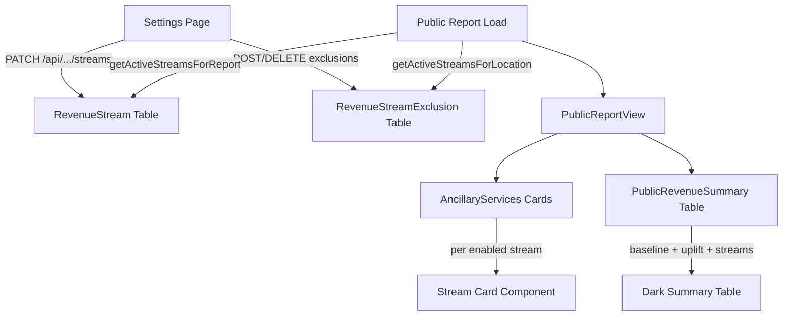

# Configurable Revenue Streams for Standard Reports

> Make the standard report system support the same ancillary revenue streams used in bespoke proposals (Smart Lockers, Self-Service Car Wash, EV Charging, Farmers Markets), with per-site toggles and configurable amounts, all rendered in the public shared report.

## User Review Required

> [!IMPORTANT]
> This plan adds a new database table (`RevenueStream`) and modifies the Prisma schema. A migration will be required, which will run against the production database on next deploy. The migration is additive only (no dropping columns or tables), so it is safe.

> [!WARNING]
> The existing `AncillaryServices` component in `PublicCommercial.tsx` currently shows hardcoded placeholder cards (Smart Lockers, Digital Signage, WeBuyAnyCar, Tesla, Waterless Car Wash, etc.). This will be **replaced** with a data-driven component that only shows streams enabled for that report. If a report has no streams enabled, the section will be hidden entirely.

---

## Design Decisions (Confirmed by User)

| Decision | Answer |
|----------|--------|
| Lockers default rate | £900/yr flat per site |
| Car Wash rate | Min/max range: £10k–£20k per site/year |
| EV Charging model | RevShare only (~£3,600/yr operator share, 15% of ~£24k GP) |
| Farmers Markets | Text-only ("£1k–£2.5k per day"), no calculations |
| Per-site or per-report | **Per-site** — each location can have different streams enabled |
| VAT | Not displayed |
| Public report rendering | Full card sections (image + bullets + pricing) **plus** portfolio summary table |
| Images | Static (existing `/lockerphoto.webp`, `/selfservicecarwash.webp`, etc.) |
| Settings UI | Simple toggles section below existing settings |
| Descriptions | Hardcoded standard ParkBunny copy |
| Storage | **Database table** (`RevenueStream`), not JSON blob |
| Existing proposals | Keep — no changes to bespoke pages |
| Baseline revenue | Use existing `estimatedRevenuePerPostcode` from report settings |
| Default stream assignment | All sites get all enabled streams; operator can deselect per-site |

---

## Proposed Changes

### Database Layer

#### [NEW] `RevenueStream` model in [schema.prisma](file:///Users/mbeckett/Documents/codeprojects/pb-reports/parkbunny/prisma/schema.prisma)

Add a new model and enum to track which revenue streams are available for each report, and a join table to control per-location enablement.

```prisma
enum StreamType {
  LOCKER
  CAR_WASH
  EV_CHARGING
  FARMERS_MARKET
}

model RevenueStream {
  id          String      @id @default(cuid())
  reportId    String
  streamType  StreamType
  enabled     Boolean     @default(true)
  ratePerSite Int?        // £ per year (e.g., 900 for lockers)
  rateMin     Int?        // For ranges (e.g., Car Wash min)
  rateMax     Int?        // For ranges (e.g., Car Wash max)
  notes       String?     // Optional text override
  createdAt   DateTime    @default(now())
  updatedAt   DateTime    @updatedAt

  report      Report      @relation(fields: [reportId], references: [id], onDelete: Cascade)
  excludedLocations RevenueStreamExclusion[]

  @@unique([reportId, streamType])
}

model RevenueStreamExclusion {
  id              String         @id @default(cuid())
  revenueStreamId String
  locationId      String
  createdAt       DateTime       @default(now())

  revenueStream   RevenueStream  @relation(fields: [revenueStreamId], references: [id], onDelete: Cascade)
  location        ReportLocation @relation(fields: [locationId], references: [id], onDelete: Cascade)

  @@unique([revenueStreamId, locationId])
}
```

**Why an exclusion table instead of an inclusion table?** The user specified "all sites get all enabled streams by default, operator can deselect." An exclusion pattern means we don't need to create `N × M` rows upfront — we just record the exceptions.

Also add relations to existing models:

```diff
model Report {
  ...
+ revenueStreams  RevenueStream[]
}

model ReportLocation {
  ...
+ streamExclusions RevenueStreamExclusion[]
}
```

---

### Shared Logic

#### [NEW] [revenue-streams.ts](file:///Users/mbeckett/Documents/codeprojects/pb-reports/parkbunny/src/lib/revenue-streams.ts)

Central module for revenue stream defaults, types, and calculation logic:

- `STREAM_DEFAULTS` — default rates, descriptions, benefit bullets, and images for each stream type
- `getActiveStreamsForReport(reportId)` — fetches enabled streams with their rates from DB
- `getActiveStreamsForLocation(reportId, locationId)` — same, but filters out excluded locations
- `calculateStreamRevenue(streams, locationCount, baseline)` — computes portfolio-wide totals
- `calculateLocationStreamRevenue(stream, baseline)` — computes per-location revenue for a single stream

Each stream type has hardcoded display metadata:

| Stream | Icon | Image | Default Rate | Description |
|--------|------|-------|-------------|-------------|
| LOCKER | `Package` | `/lockerphoto.webp` | £900/yr | Solar powered, zero maintenance, fully insured, 1-year contract |
| CAR_WASH | `Car` | `/selfservicecarwash.webp` | £10k–£20k range | Zero CAPEX, all hardware supplied & maintained, fully insured |
| EV_CHARGING | `Zap` | `/ev-charging.webp` | ~£3,600/yr (RevShare) | Revenue share model, zero upfront cost, 15% operator share |
| FARMERS_MARKET | `ShoppingBag` | `/market.webp` | Text: £1k–£2.5k/day | Subject to survey, no annual calculation |

---

### API Layer

#### [MODIFY] [route.ts](file:///Users/mbeckett/Documents/codeprojects/pb-reports/parkbunny/src/app/api/reports/[id]/settings/route.ts)

Extend the existing `PATCH` handler to accept a `revenueStreams` array in the request body. When present, upsert `RevenueStream` records for the report.

#### [NEW] [route.ts](file:///Users/mbeckett/Documents/codeprojects/pb-reports/parkbunny/src/app/api/reports/[id]/streams/route.ts)

New API route for revenue stream CRUD:

- `GET` — Returns all revenue streams for a report, including exclusion lists
- `PATCH` — Upserts a revenue stream (toggle enabled, change rates)
- `DELETE` — Removes a revenue stream from a report

#### [NEW] [route.ts](file:///Users/mbeckett/Documents/codeprojects/pb-reports/parkbunny/src/app/api/reports/[id]/streams/[streamId]/exclusions/route.ts)

Per-location exclusion management:

- `POST { locationId }` — Exclude a location from a stream
- `DELETE { locationId }` — Re-include a location in a stream

---

### Settings UI

#### [MODIFY] [page.tsx](file:///Users/mbeckett/Documents/codeprojects/pb-reports/parkbunny/src/app/reports/[id]/settings/page.tsx)

Add a new **"Revenue Streams"** section below the existing "Commercial Terms" section:

```
┌─────────────────────────────────────────────┐
│ Revenue Streams                              │
├─────────────────────────────────────────────┤
│ ☑ Smart Lockers         £ [900] /yr/site    │
│ ☑ Self-Service Car Wash  £ [10000]-[20000]  │
│ ☐ EV Charging (RevShare) £ [3600] /yr/site  │
│ ☐ Farmers Markets        £1k–£2.5k/day      │
│                                              │
│ Per-Location Overrides:                      │
│  📍 SW1A 1AA  ☑Lock ☑Wash ☐EV  ☐Market     │
│  📍 M1 1AD    ☑Lock ☐Wash ☐EV  ☐Market     │
│  📍 LS1 1UR   ☑Lock ☑Wash ☑EV  ☐Market     │
└─────────────────────────────────────────────┘
```

**Behaviour:**
- Report-level toggles enable/disable the stream for the entire report
- Once a stream is enabled, a per-location grid appears showing all postcodes with checkboxes (all checked by default)
- Unchecking a location creates a `RevenueStreamExclusion` record
- Rate fields are editable numbers (except Farmers Markets which is text-only)
- On Save, the component calls `PATCH /api/reports/[id]/streams` for each stream

---

### Public Report Rendering

#### [MODIFY] [PublicReportView.tsx](file:///Users/mbeckett/Documents/codeprojects/pb-reports/parkbunny/src/components/report/PublicReportView.tsx)

1. Fetch revenue streams for the report using the new lib function
2. Pass stream data to new components
3. Insert new sections before the footer:
   - **Revenue Stream Cards** — one per enabled stream
   - **Portfolio Revenue Summary Table** — dark table combining baseline + local offers + all streams

#### [MODIFY] [PublicCommercial.tsx](file:///Users/mbeckett/Documents/codeprojects/pb-reports/parkbunny/src/components/report/public/PublicCommercial.tsx)

Replace the existing hardcoded `AncillaryServices` component with a data-driven version:

- **`AncillaryServices({ streams, locationCount, baseline })`** — receives active streams from `PublicReportView` and renders a card for each
- Each card follows the existing proposal pattern: icon + title + description + bullet points + pricing box + image
- If no streams are enabled, the entire section is hidden

#### [NEW] [PublicRevenueSummary.tsx](file:///Users/mbeckett/Documents/codeprojects/pb-reports/parkbunny/src/components/report/public/PublicRevenueSummary.tsx)

The dark "Portfolio Revenue Summary" table, containing:

| Revenue Stream | Sites | Annual Revenue | Status |
|---------------|-------|---------------|--------|
| Portfolio Baseline | N | £Xk | Current |
| Local Offers Uplift | N | +£Yk | +Z% |
| Smart Lockers | N | +£900 × N | Confirmed |
| Self-Service Car Wash | N | +£10k–£20k × N | Portfolio-Wide |
| *(etc. for each enabled stream)* | | | |
| **Total Revenue Opportunity** | **N** | **£Total** | |

This mirrors the summary tables in the BuzzBingo and ParkBee proposals.

---

### Data Flow



---

### Files Changed Summary

| Action | File | Description |
|--------|------|-------------|
| **MODIFY** | `prisma/schema.prisma` | Add `StreamType` enum, `RevenueStream` model, `RevenueStreamExclusion` model, and relations |
| **NEW** | `src/lib/revenue-streams.ts` | Defaults, types, DB queries, and calculation helpers |
| **MODIFY** | `src/app/api/reports/[id]/settings/route.ts` | Add revenue stream auto-creation on report settings save |
| **NEW** | `src/app/api/reports/[id]/streams/route.ts` | CRUD API for revenue streams |
| **NEW** | `src/app/api/reports/[id]/streams/[streamId]/exclusions/route.ts` | Per-location exclusion API |
| **MODIFY** | `src/app/reports/[id]/settings/page.tsx` | Add revenue streams toggle section with per-location grid |
| **MODIFY** | `src/components/report/PublicReportView.tsx` | Fetch and pass stream data to new components |
| **MODIFY** | `src/components/report/public/PublicCommercial.tsx` | Replace hardcoded `AncillaryServices` with data-driven version |
| **NEW** | `src/components/report/public/PublicRevenueSummary.tsx` | Portfolio revenue summary dark table |

---

## Verification Plan

### Automated Testing

There are currently **no test files** in the project (confirmed via search). Given that constraint:

1. **Prisma migration** — Run `npx prisma migrate dev --name add-revenue-streams` and verify it completes without errors
2. **TypeScript build** — Run `npm run build` and verify zero type errors across all modified files
3. **Lint** — Run `npx next lint` and verify no new lint errors

### Manual Verification (Browser)

> [!NOTE]
> All browser verification should be done with the dev server running (`npm run dev`).

**Test 1: Settings Page — Enable streams**
1. Navigate to an existing report's settings page (e.g., `/reports/cmli4vtqa0001l4045brs07ye/settings`)
2. Scroll to the "Revenue Streams" section
3. Toggle on "Smart Lockers" — verify a rate field appears with `£900` default
4. Toggle on "Self-Service Car Wash" — verify min/max fields appear with `£10,000` / `£20,000`
5. Toggle on "EV Charging" — verify rate field shows `£3,600`
6. Toggle on "Farmers Markets" — verify text shows "£1k–£2.5k/day" with no editable rate
7. Click Save → verify no errors

**Test 2: Settings Page — Per-location exclusions**
1. With streams enabled, verify a "Per-Location Overrides" grid appears showing all the report's postcodes
2. Uncheck "Car Wash" for one location → Save
3. Reload the page → verify the unchecked state persists

**Test 3: Public Report — Stream Cards**
1. Ensure the report has sharing enabled with a password
2. Open the share URL in an incognito window, enter the password
3. Scroll to find the "Additional Portfolio Uplift" section
4. Verify each enabled stream has a card with: icon, title, description bullets, pricing box, and image
5. Verify streams that are off do NOT appear
6. Verify the Farmers Markets card shows text only with no annual calculation

**Test 4: Public Report — Summary Table**
1. On the same shared report, scroll to the bottom
2. Verify the dark "Portfolio Revenue Summary" table contains:
   - Portfolio Baseline row (using `estimatedRevenuePerPostcode × locationCount`)
   - Local Offers Uplift row (existing calculation)
   - One row per enabled stream with correct rates × applicable site count
   - Total row summing all of the above
3. Verify that excluded locations are NOT counted in stream rows (e.g., if one site has Car Wash excluded, the Car Wash row should show `N-1` sites)

**Test 5: Edge case — No streams enabled**
1. Go to a report settings page and ensure all streams are toggled OFF → Save
2. View the shared public report
3. Verify the "Additional Portfolio Uplift" and "Portfolio Revenue Summary" sections are **not rendered** at all
